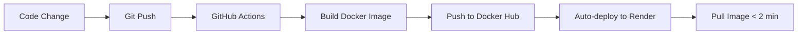

# Fast Render Deployment Guide 🚀

## Problem
Every deployment to Render takes 10-15 minutes because it:
- Downloads all Python packages from scratch
- Compiles dlib, face_recognition, faiss
- No caching between deployments

## Solution: Pre-built Docker Images

Deploy a pre-built Docker image that already has all dependencies installed. Render just pulls the image and deploys (< 2 minutes!)

## Setup Steps

### 1. Create Docker Hub Account (Free)
- Go to https://hub.docker.com/signup
- Create a free account
- Remember your username

### 2. Set Up GitHub Secrets
Go to your GitHub repo → Settings → Secrets and variables → Actions

Add these secrets:
- `DOCKER_USERNAME`: Your Docker Hub username
- `DOCKER_PASSWORD`: Your Docker Hub password/token

### 3. Build and Push Initial Image

**Option A: Using GitHub Actions (Automated)**
```bash
# Commit the workflow file
git add .github/workflows/build-and-push.yml
git commit -m "Add Docker build workflow"
git push

# GitHub will automatically build and push to Docker Hub
```

**Option B: Manual Build (One-time)**
```bash
# Login to Docker Hub
docker login

# Build the image
docker build -t yourusername/fmf-api:latest .

# Push to Docker Hub
docker push yourusername/fmf-api:latest
```

### 4. Update Render Configuration

**Method 1: Use Blueprint (Recommended)**
1. Update `Dockerfile.render` - Replace `yourusername` with your Docker Hub username
2. Push to GitHub:
   ```bash
   git add render-docker.yaml Dockerfile.render
   git commit -m "Switch to pre-built Docker images"
   git push
   ```
3. In Render Dashboard:
   - Go to your service
   - Settings → Build & Deploy
   - Change to use `render-docker.yaml` as blueprint

**Method 2: Manual Configuration**
In Render Dashboard:
1. Go to your service → Settings
2. Runtime: **Docker**
3. Dockerfile Path: `./Dockerfile.render`
4. Environment Variables (keep existing ones)

### 5. Deploy!
Now deployments will be MUCH faster:
- ✅ First deployment: ~5 minutes (pulling image)
- ✅ Subsequent deployments: ~1-2 minutes (cached image)

## How It Works

### Before (Slow ❌)
```
Render Build:
1. Install Python ────────── 2 min
2. Install numpy ─────────── 3 min
3. Install dlib ──────────── 5 min
4. Install face_recognition ─ 3 min
5. Install other packages ─── 2 min
Total: 15+ minutes 😫
```

### After (Fast ✅)
```
GitHub Actions (runs once):
Build image with all deps ─── 15 min (one time)
Push to Docker Hub ────────── 1 min

Render Deployment:
Pull pre-built image ──────── 1 min
Copy app code ────────────── 30 sec
Start service ────────────── 30 sec
Total: 2 minutes! 🚀
```

## Workflow



## When to Rebuild Base Image

Only rebuild when you:
- ✅ Change `requirements.txt` (new Python packages)
- ✅ Change `Dockerfile` (system dependencies)
- ❌ NOT for code changes in `app/` folder

The GitHub workflow automatically rebuilds when needed!

## Alternative: Layer Caching (If you don't want Docker Hub)

Optimize your existing Dockerfile:
```dockerfile
# Group stable dependencies together
RUN pip install numpy Pillow fastapi uvicorn

# Expensive packages cached separately
RUN pip install dlib face_recognition

# Install frequently changing packages last
RUN pip install -r requirements-dynamic.txt
```

## Cost Comparison

| Method | First Deploy | Subsequent | Docker Hub Cost |
|--------|-------------|------------|-----------------|
| Current | 15 min | 15 min | $0 |
| Pre-built Image | 5 min | 2 min | $0 (free tier) |
| Layer Cache | 10 min | 8 min | $0 |

## Troubleshooting

**Image not found**
```bash
# Make sure image is public in Docker Hub
docker pull yourusername/fmf-api:latest
```

**Build fails on GitHub**
- Check GitHub Actions logs
- Verify DOCKER_USERNAME and DOCKER_PASSWORD secrets

**Render can't pull image**
- Make Docker Hub repo public
- Or add Docker Hub credentials in Render

## Bonus: Local Testing

Test the production image locally:
```bash
docker pull yourusername/fmf-api:latest
docker run -p 8000:8000 yourusername/fmf-api:latest
```

Visit http://localhost:8000/health

## Summary

✅ **10x faster deployments** (15 min → 2 min)  
✅ **Free solution** (Docker Hub free tier)  
✅ **Automated** (GitHub Actions builds automatically)  
✅ **Reliable** (same image every time)

Now you can deploy changes quickly without waiting for dependency installation! 🎉
